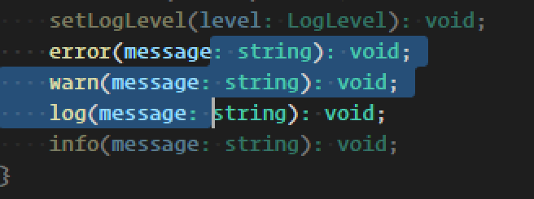

# vscode-dimmer 

## Features

Dims text outside of selections by reducing the opacity of the text. Supports multiple selections.

  

Set a keybinding for `dimmer.ToggleDimmer`, search `Toggle Dimmer` in the command palette, or use the `dimmer.enabled` setting.

## Configuration

```
"dimmer.enabled": {
    "default": false,
    "description": "When set to true, the extension will dim non-selected text."
},
"dimmer.opacity": {
    "default": 50,
    "description": "An integer between 0 and 100 used for the opacity percentage for the dimmed (non-selected) text."
},
"dimmer.delay": {
    "default": 0,
    "description": "Delay in milliseconds for dimming the non-selected text to reduce number of API calls in the event of rapid selection changes. Defaults to 0, but set higher if it feels like it is causing problems."
},
"dimmer.toggleDimmerCommandScope": {
    "defualt": "user",
    "description": "Enum to set whether the `ToggleDimmer` command will affect the user (global) or workspace (local) settings."
},
"dimmer.dimSelectedLines": {
    "default": false,
    "description": "When set to true, the extension will dim ALL non-selected text. By default it will not dim any text on a line with a selection."
}
```

### 1.0.0

Initial release